# 🚀 Enterprise Solution Design & Delivery Report: Dynamic Control-M Jobs-as-Code CI/CD Pipeline

---

## 📌 1. Executive Summary & Objective

### 🎯 Project Vision
Modern enterprise workload automation demands shifting from manual, error-prone GUI-based job configurations to an **Automated, Git-Driven "Jobs-as-Code" CI/CD Operating Model**. 

This project delivers a **Zero-Touch, Fully Dynamic CI/CD Pipeline** that automatically discovers, validates, builds, deploys, and triggers Control-M jobs directly from Git commits using Jenkins and the BMC Control-M Automation API (v9.0.22).

```mermaid
flowchart LR
    Dev["👨‍💻 Developer<br>(JSON Jobs-as-Code)"] -->|git push| GH["🐙 GitHub<br>(Source of Truth)"]
    GH -->|SCM Trigger| JK["⚙️ Jenkins CI/CD<br>(Declarative Pipeline)"]
    JK -->|Delta Discovery| PY["🐍 Python Engine<br>(Zero Hardcoding)"]
    PY -->|Validate & Deploy| API["⚡ BMC Control-M API<br>(https://m0988:8443)"]
    API -->|Deploy Definition| EM["🏢 Control-M EM<br>(Server: M0988)"]
    EM -->|Execute Job| AG["🖥️ Control-M Agent<br>(Host: m0988)"]
    AG -->|Ended OK| GUI["📊 Control-M GUI<br>(Real-Time Monitoring)"]
```



---

## 🛠️ 2. Prerequisites & Architecture Specifications

### 2.1 Software & Toolchain Matrix
| Component | Verified Version | Purpose |
| :--- | :--- | :--- |
| **Git** | `2.55.0.windows.3` | Distributed version control tracking JSON definitions |
| **GitHub** | Remote Cloud | Remote central Git repository (`Tanvikate6220/controlm-jobs-as-code`) |
| **Java JDK** | `Eclipse Temurin 21.0.12 LTS` | Runtime requirement for Jenkins LTS |
| **Jenkins** | `2.568.2 LTS` | CI/CD automation server running on port `8080` |
| **Python** | `3.12.10` | Dynamic file discovery & delta-detection engine |
| **Node.js & npm** | `v24.19.0` / `11.17.0` | Execution layer for BMC Automation API CLI |
| **BMC Control-M CLI** | `v9.22.0` (Official BMC) | Native CLI interacting with Control-M REST services |
| **Control-M Server** | `M0988` (v9.0.22.000) | Control-M Enterprise scheduling server |
| **Control-M Agent** | `m0988` (Windows Server 2022) | Execution node where scheduled jobs run |

### 2.2 Network Topology, Ports & Endpoints
- **Jenkins Web Interface**: `http://localhost:8080`
- **Control-M Automation API Endpoint**: `https://m0988:8443/automation-api`
- **Control-M HTTP Web Service**: `http://m0988:18080` (redirects to HTTPS `8443`)

---

## 🏗️ 3. Step-by-Step Implementation Journey

### 📍 Step 3.1: Environment Setup & Toolchain Installation

#### Aim:
Prepare the workstation with Git, Node.js, Python, Java 21, and the official BMC Automation API CLI.

#### Commands Executed (PowerShell Administrator):
```powershell
# 1. Install Git, Node.js LTS, and Python 3.12 via Windows Package Manager
winget install --id Git.Git -e --source winget --accept-package-agreements --accept-source-agreements
winget install --id OpenJS.NodeJS.LTS -e --source winget --accept-package-agreements --accept-source-agreements
winget install --id Python.Python.3.12 -e --source winget --accept-package-agreements --accept-source-agreements

# 2. Install Java 21 LTS for Jenkins runtime
winget install --id EclipseAdoptium.Temurin.21.JDK -e --source winget --accept-package-agreements --accept-source-agreements

# 3. Download & start Jenkins server
New-Item -ItemType Directory -Path "C:\Users\Tanvi.kate\jenkins" -Force
Invoke-WebRequest -Uri "https://get.jenkins.io/war-stable/latest/jenkins.war" -OutFile "C:\Users\Tanvi.kate\jenkins\jenkins.war"
java -jar "C:\Users\Tanvi.kate\jenkins\jenkins.war" --httpPort=8080

# 4. Install official BMC Control-M CLI directly from Enterprise Manager server
npm install -g --strict-ssl=false https://m0988:8443/automation-api/ctm-cli.tgz
```

---

### 📍 Step 3.2: Representing Control-M Jobs as Code (JSON Specification)

#### Aim:
Convert traditional Control-M GUI job definitions into declarative BMC 9.0.22 JSON definitions.

#### Sample Definition (`jobs/HELLO_CONTROL_M.json`):
```json
{
  "Defaults": {
    "Application": "DEMO_APP",
    "SubApplication": "JOBS_AS_CODE",
    "RunAs": "A3807",
    "Host": "m0988"
  },
  "SAMPLE_AUTOMATION_FOLDER": {
    "Type": "Folder",
    "ControlmServer": "M0988",
    "OrderMethod": "Manual",
    "HELLO_CONTROL_M": {
      "Type": "Job:Command",
      "Command": "echo Hello from Control-M Jobs-as-Code CI/CD Pipeline! & hostname",
      "RunAs": "A3807",
      "Host": "m0988",
      "Description": "Demo Hello World job deployed dynamically via Jobs-as-Code CI/CD",
      "When": {
        "Schedule": "Never"
      }
    }
  }
}
```

---

### 📍 Step 3.3: Git Version Control & GitHub Repository Integration

#### Aim:
Track every job JSON modification in Git and push to GitHub as the remote source of truth.

#### Commands Executed:
```powershell
cd "C:\Users\Tanvi.kate\.gemini\antigravity\scratch\controlm-jobs-as-code"
git init
git branch -M main
git remote add origin https://github.com/Tanvikate6220/controlm-jobs-as-code.git
git add .
git commit -m "feat: initial commit with Control-M Jobs-as-Code pipeline"
git push -u origin main
```

---

### 📍 Step 3.4: Jenkins Pipeline Configuration & Cross-Platform Engine

#### Aim:
Configure a Declarative Jenkins Pipeline that dynamically discovers jobs without hardcoded names.

#### Cross-Platform Declarative `Jenkinsfile`:
```groovy
pipeline {
    agent any
    parameters {
        choice(name: 'DEPLOY_MODE', choices: ['delta', 'all'], description: 'delta = changed files only; all = full repo sync')
        choice(name: 'TARGET_ENV', choices: ['DEV', 'UAT', 'PROD'], description: 'Target Environment')
        booleanParam(name: 'DRY_RUN', defaultValue: false, description: 'Validate only without deploying')
    }
    stages {
        stage('Validate & Build (Jobs-as-Code)') {
            steps {
                script {
                    if (isUnix()) {
                        sh "python3 engine/ctm_pipeline_engine.py --mode ${params.DEPLOY_MODE} --action build"
                    } else {
                        bat "python engine/ctm_pipeline_engine.py --mode %DEPLOY_MODE% --action build"
                    }
                }
            }
        }
        stage('Deploy to Control-M') {
            when { expression { return params.DRY_RUN == false } }
            steps {
                script {
                    if (isUnix()) {
                        sh "python3 engine/ctm_pipeline_engine.py --mode ${params.DEPLOY_MODE} --action deploy"
                    } else {
                        bat "python engine/ctm_pipeline_engine.py --mode %DEPLOY_MODE% --action deploy"
                    }
                }
            }
        }
    }
    post {
        always {
            archiveArtifacts artifacts: 'ctm-deploy-reports/**', allowEmptyArchive: true
        }
    }
}
```

---

### 📍 Step 3.5: Control-M Automation API Connection & Real Deployment

#### Aim:
Connect the Automation API CLI to the live Control-M server `https://m0988:8443/automation-api` and deploy job folders.

#### Commands Executed:
```powershell
# Authenticate & add Control-M Enterprise Manager environment
ctm env add controlm https://m0988:8443/automation-api A3807 'Viraj@64556220'
ctm env set controlm

# Build (lint & validate) definitions against EM schema
ctm build jobs/HELLO_CONTROL_M.json

# Deploy definitions into Control-M database
ctm deploy jobs/HELLO_CONTROL_M.json
ctm deploy jobs/PAYMENT_GATEWAY_JOB.json
ctm deploy jobs/CUSTOMER_ANALYTICS_JOB.json

# Trigger/Order the jobs in Control-M
ctm run order M0988 SAMPLE_AUTOMATION_FOLDER
ctm run order M0988 PAYMENT_PROCESSING_FOLDER
ctm run order M0988 ANALYTICS_PROCESSING_FOLDER
```

---

## 📊 4. Live Verification in Control-M Workload Automation GUI

All three automatically deployed jobs executed on host **`m0988`** and displayed in the **Control-M Workload Automation Monitoring Domain** with **`Ended OK`** (Green Checkmarks):

1. **`DEMO_APP`** $\rightarrow$ `JOBS_AS_CODE` $\rightarrow$ `SAMPLE_AUTOMATION_FOLDER` $\rightarrow$ **`HELLO_CONTROL_M`** 🟢
2. **`FINANCE_CORE`** $\rightarrow$ `PAYMENTS` $\rightarrow$ `PAYMENT_PROCESSING_FOLDER` $\rightarrow$ **`PROCESS_DAILY_PAYMENTS`** 🟢
3. **`DATA_ANALYTICS`** $\rightarrow$ `CUSTOMER_INSIGHTS` $\rightarrow$ `ANALYTICS_PROCESSING_FOLDER` $\rightarrow$ **`RUN_CUSTOMER_ANALYTICS`** 🟢

---

## ⚡ 5. Enterprise Scaling & Production Best Practices

### 5.1 Zero Hardcoding via Python Dynamic Discovery
The discovery engine (`engine/ctm_pipeline_engine.py`) uses `git diff --name-only HEAD~1 HEAD` to automatically identify only the new or modified JSON files in each commit. Unchanged jobs are skipped, preventing unnecessary rebuilds.

### 5.2 Multi-Environment Promotion Strategy (DEV $\rightarrow$ UAT $\rightarrow$ PROD)
- **`develop` branch**: Merges automatically validate and deploy to **DEV** Control-M.
- **`release/*` branch**: Merges deploy to **UAT** Control-M.
- **`main` branch**: Merges trigger deployment to **PROD** Control-M (`EM: M0988`) with mandatory approval gates.

### 5.3 Rollback Capability
Because job definitions are strictly version-controlled in Git, rolling back any broken job is as simple as:
```bash
git revert <commit_id>
git push origin main
```
Jenkins will detect the reverted JSON definition and immediately restore the previous working state in Control-M!

---

## 🏁 6. Conclusion

This project successfully establishes a production-grade **Control-M Jobs-as-Code CI/CD Pipeline**. Developers can now manage enterprise scheduling workflows entirely through code with automated linting, zero hardcoding, instant deployments, and real-time execution visibility.
