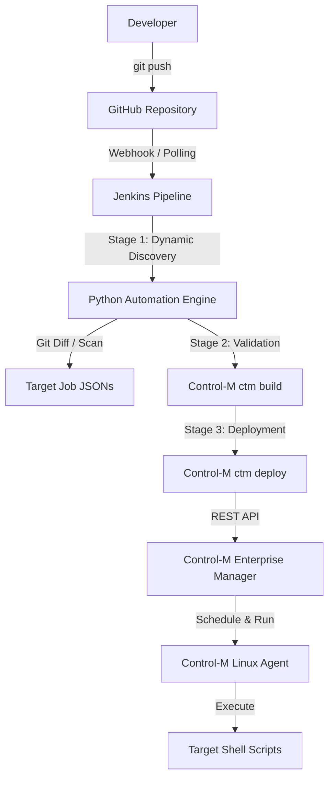

# Control-M Jobs-as-Code Dynamic CI/CD Pipeline

This repository implements a fully automated, dynamic CI/CD workflow for BMC Control-M 9.0.22 using **Jobs-as-Code**, **Git**, **GitHub**, **Jenkins**, and **Python**.

---

## 🏗️ Architecture Flow



---

## 📂 Repository Structure

```text
controlm-jobs-as-code/
├── .gitignore
├── Jenkinsfile                  # Dynamic Jenkins Declarative Pipeline
├── README.md
├── engine/
│   └── ctm_pipeline_engine.py   # Zero-touch Dynamic Discovery & Deploy Engine
├── jobs/
│   ├── HELLO_CONTROL_M.json     # Control-M Job definition (9.0.22)
│   └── NEW_DATA_PIPELINE_JOB.json
└── scripts/
    └── hello_control_m.sh       # Executable script for Linux Agent
```

---

## 🚀 Key Features

1. **Zero Hardcoding**: Jenkins never hardcodes job file names.
2. **Delta Deployment**: Automatically calculates `git diff` to deploy only new or modified jobs per commit.
3. **Full Sync Capability**: Can be triggered manually with `DEPLOY_MODE=all` to sync every job in the repository.
4. **Offline & Online Validation**: Local JSON structure verification and live `ctm build` execution.
5. **Audit Logging**: Produces detailed JSON & Markdown deployment reports under `ctm-deploy-reports/`.
